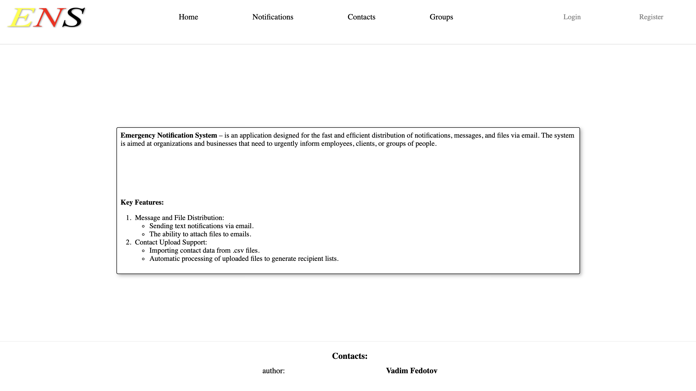
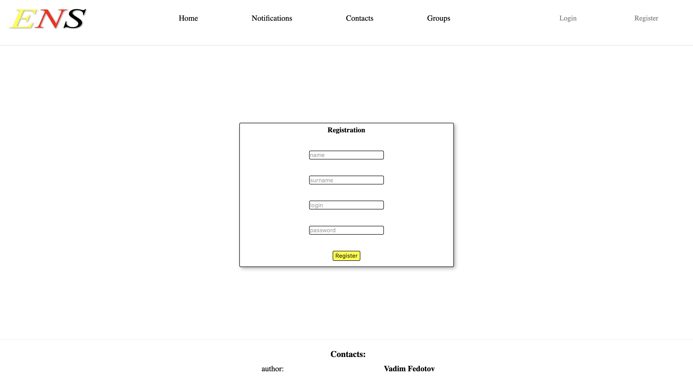
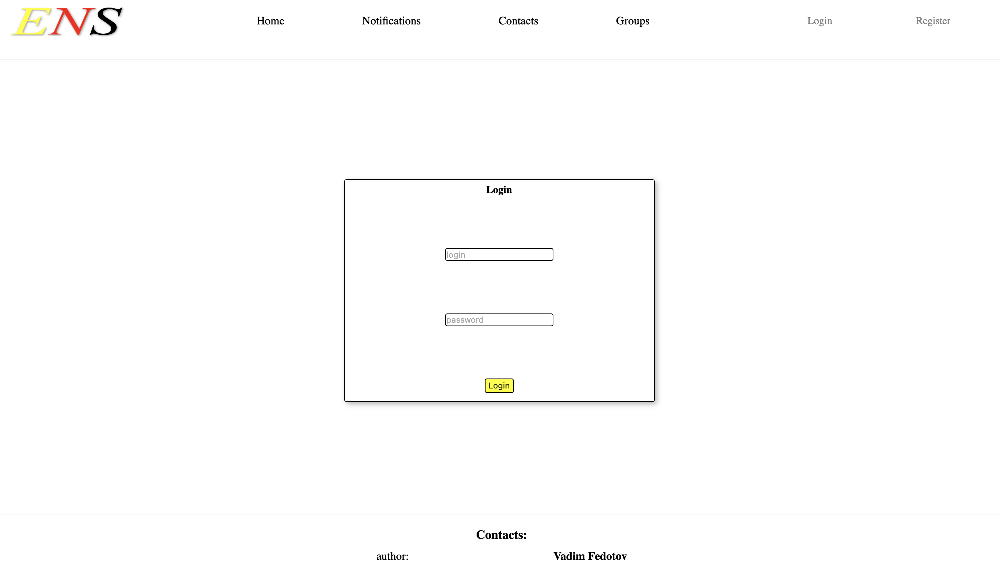
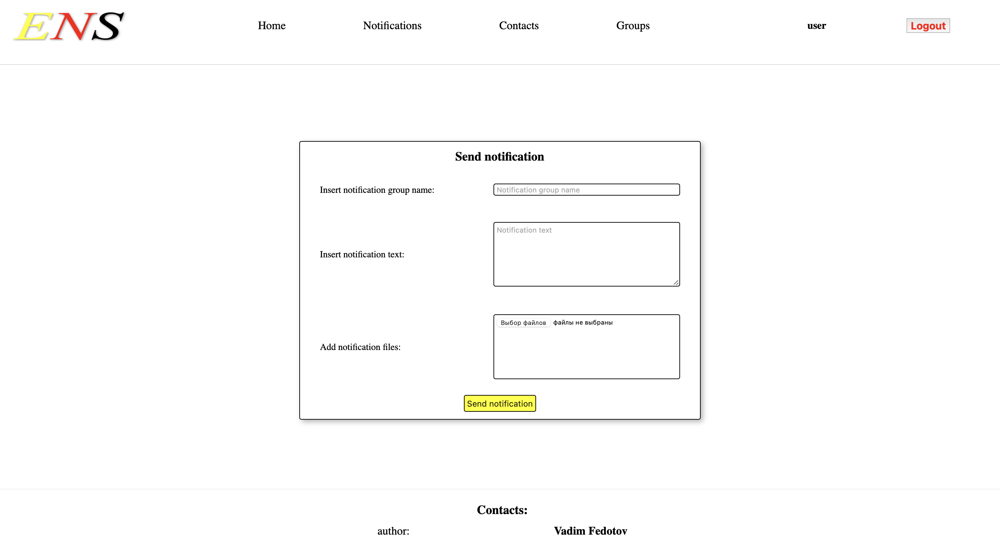
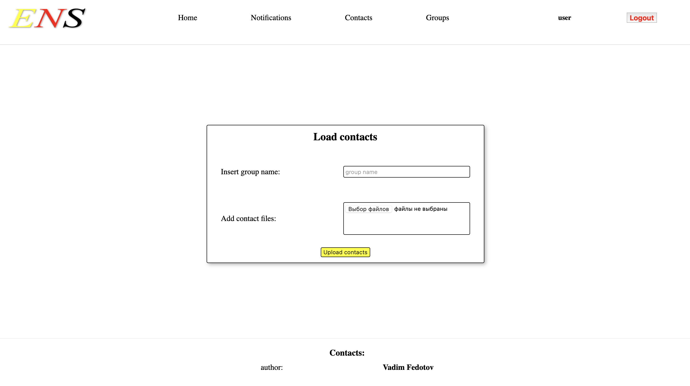
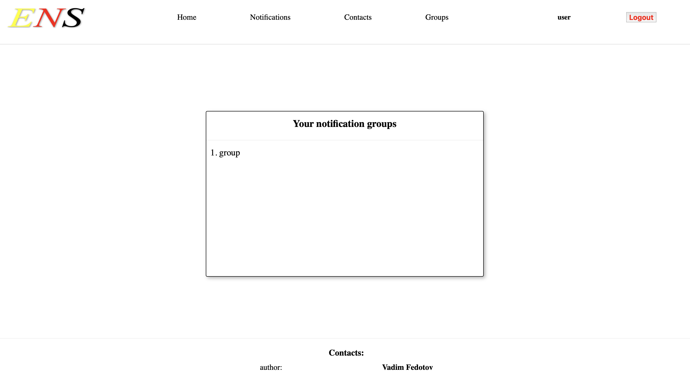
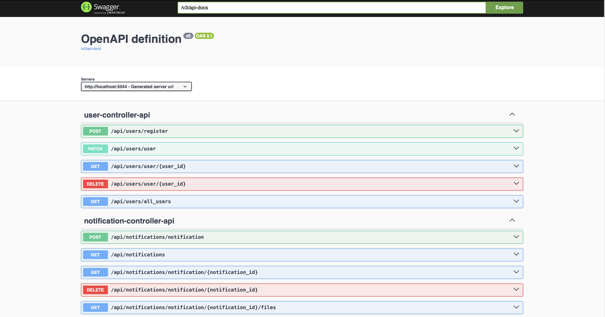
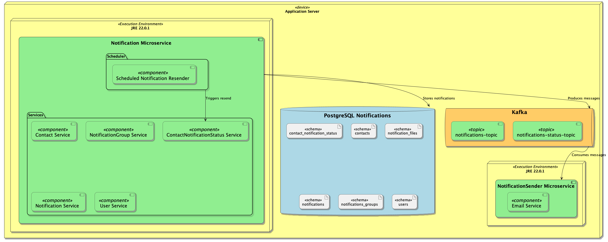

# Emergency Notification System

## Overview

The **Emergency Notification System** is an application designed for the fast and efficient distribution of notifications, messages, and files via email. It is tailored for organizations and businesses that need to urgently inform employees, clients, or groups of people. The system includes a user-friendly frontend interface as well as an API with Swagger documentation, enabling users to perform necessary functions easily and efficiently.

## Features

- **User and Contact Upload**: Allows users to upload contacts via a `.csv` file.
- **Notification Template Creation**: Users can create notification templates and configure the intended recipients.
- **Automatic Email Notifications**: Automatically sends notifications to the specified email addresses when a notification is sent to the entire recipient group.
- **User Registration, Authentication, and Authorization**: Secure registration, authentication, and authorization for users.

## Frontend Interface

1. **Home Page**:
    - Provides information about the purpose and functionality of the application.
    

2. **Registration Page**:
    - Allows users to create a new account with a unique login.
   
    

3. **Login Page**:
    - A page where users can log in to their accounts.
   
    

4. **Notification Sending Page**:
    - A page where users can create and send notifications.
   
   

5. **Contact Upload Page**:
    - A page where users can upload contacts via `.csv` file.
   
   

6. **Group List Page**:
    - A page displaying the list of contact groups.
   
   

## API

The API, with Swagger documentation, is available only for users with administrator rights.



## Architecture



The application consists of two microservices that communicate with each other via Kafka:

### 1. Notification Microservice

#### Description

The **Notification Microservice** is responsible for user registration, authentication, and authorization, as well as for creating, managing, and delivering notifications. It integrates with Kafka to handle real-time events and supports efficient management of contact lists and groups. This microservice enables organizations to quickly send notifications to users or groups, track notification statuses, and manage the resending of notifications using an integrated scheduler.

#### Features

- **User Management**:
    - **Registration**: Allows the registration of new users with the required credentials.
    - **Authentication and Authorization**: Ensures secure login and verifies user identity, providing access control.

- **Notification Creation**:
    - **Text and File Attachments**: Create notifications with text content and file attachments, sending them to individual users or groups.

- **Kafka Integration**:
    - Generates events related to notification creation and sends them to the Kafka queue, enabling asynchronous processing and integration with other services.

- **Contact Management**:
    - Supports the upload of contacts from `.csv` files for easy import.
    - Allows the creation of contact groups to simplify mass notification delivery.

- **Notification Status Management**:
    - Tracks and updates notification statuses (e.g., sent, not delivered, pending).
    - Ability to update the delivery status for each contact.

- **Scheduler Service**:
    - Monitors sent notifications and automatically resends them if the notification status remains unchanged for a certain period.

- **Scalability and Reliability**:
    - Designed to handle a large volume of notifications with high availability.
    - Uses an event-driven architecture, ensuring efficient and reliable message processing.

- **Logging and Event Monitoring**:
    - Detailed logs of notification events, including status changes and errors, ensuring transparency and simplifying diagnostics.

- **Security**:
    - Ensures secure user authentication and authorization, protecting sensitive data and communication channels.

### 2. Notification Sending Microservice

#### Description

The **Notification Sending Microservice** is responsible for asynchronously processing events received from Kafka from the Notification Microservice. It efficiently manages multi-threaded processes to send notifications to specified email addresses. After successfully sending notifications, it generates an event to update the notification status and sends it back to Kafka for further processing. This microservice ensures the reliability and scalability of the notification delivery system.

#### Features

- **Asynchronous Notification Sending**:
    - Receives events from the Notification Microservice via Kafka containing details about created notifications.
    - Asynchronously processes each notification and sends it to the specified email address.

- **Status Event Generation**:
    - After successful delivery, generates an event to update the notification status (e.g., “sent”).
    - Sends the status event back to Kafka to update the notification status in the Notification Microservice.

- **Multi-threading and Scalability**:
    - Utilizes multi-threading to ensure fast, efficient notification delivery, making it ideal for handling large data volumes.

- **Kafka Integration**:
    - Events from the Notification Microservice and notification delivery results are processed via Kafka, maintaining high performance and reliability in asynchronous message processing.

## Containerization

The application can be deployed in Docker containers. To set up and run the application, follow these steps:

1. **Build the Docker images**:

```bash
docker build -t notification_sender -f Dockerfile_notification_sender .
docker build -t notification -f Dockerfile_notification .
```

2. **Run the application**:

```bash
docker-compose up
```

## Technology Stack

**Languages**: Java, CSS, HTML \
**Frameworks**: Spring (Boot, Web, DataJpa, Thymeleaf), Kafka \
**Development Tools**: Docker, Gradle